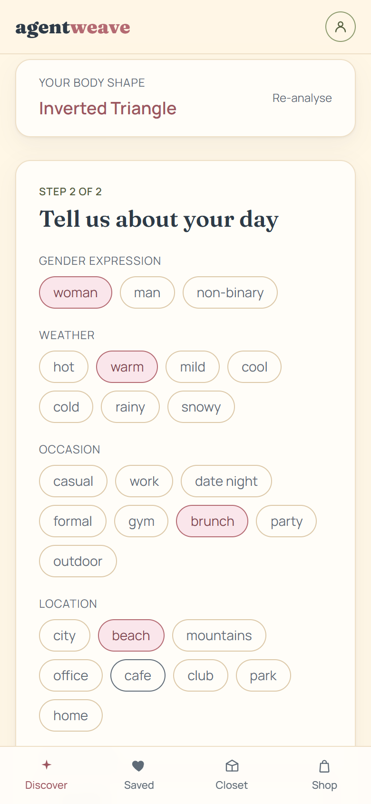
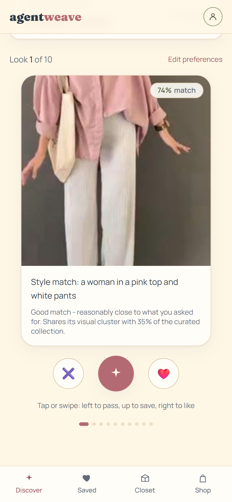
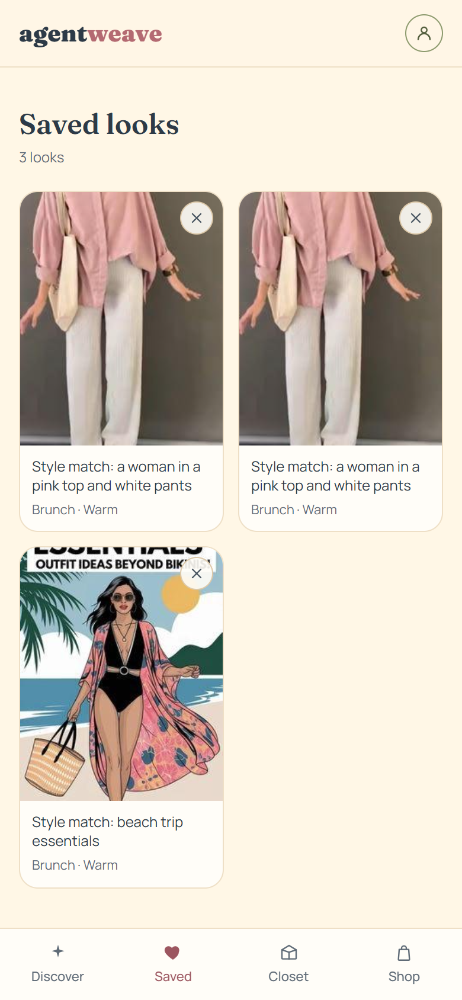
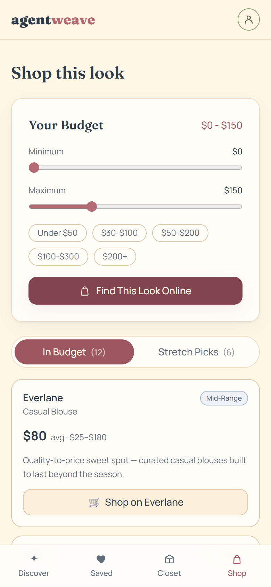
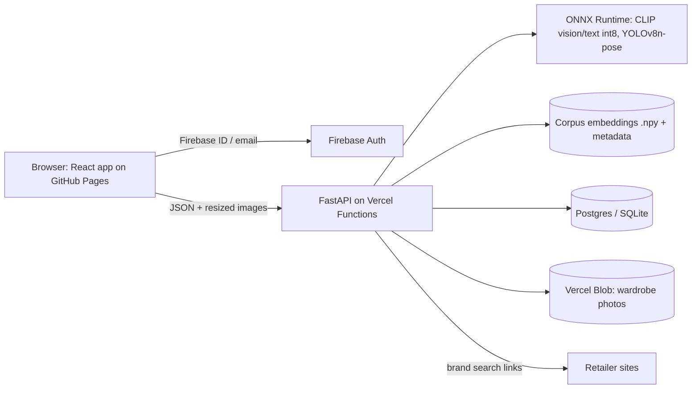

# AgentWeave

AgentWeave is a fashion recommendation web app. Upload a full-body photo, describe your day, then swipe through outfit ideas: pass, like, or save them to an inspiration board. You can also shop the look from real retailers within a budget, or get outfit suggestions from photos of your own clothes.

- **Frontend:** React 19 (Create React App), Tailwind CSS, Firebase Auth, deployed to GitHub Pages
- **Backend:** FastAPI, SQLAlchemy, ONNX Runtime, deployable on Vercel Functions (Render config kept as an alternative)
- **ML:** LoRA-fine-tuned CLIP ViT-B/32 for retrieval (weight-only int8) and YOLOv8n-pose for body-shape estimation, both served as ONNX models without PyTorch

**Live app:** https://dhy-ani.github.io/agentweave. API: https://agentweave-api.vercel.app ([health](https://agentweave-api.vercel.app/health), [docs](https://agentweave-api.vercel.app/docs)). Every push to `main` redeploys both.

This README walks through how the app was rebuilt, stage by stage, the way a professional team would build it. Each stage links to the detailed document behind it, and the whole set is indexed in [docs/](docs/README.md): research, PRD, design decisions, [ADRs](docs/adr/README.md), the [model card](docs/ml/model-card.md) and [dataset card](docs/ml/dataset-card.md), and the [testing](docs/engineering/testing.md) and [deployment](docs/engineering/deployment.md) guides.

| Preferences | Swipe deck | Saved board | Shop |
|---|---|---|---|
|  |  |  |  |

These screenshots come from the running app, not mockups. `frontend/scripts/capture-screenshots.mjs` regenerates them with Playwright and the system Chrome against a local backend and the Firebase emulator. The design files are in Figma (wireframes, design system and high-fidelity screens).

---

## How it was built, step by step

### 1. Product and market research
Before any design work, desk research covered nine competitors across visual inspiration (Pinterest), algorithmic styling (Stitch Fix), wardrobe apps (Whering, Stylebook, Acloset, Indyx), shopping aggregators (Lyst, ShopStyle/LTK) and swipe-based fashion discovery. Every figure cites its source, and claims that couldn't be verified were left out on purpose.
- [Market research](docs/product/01-market-research.md)
- [Hypothesis personas and jobs to be done](docs/product/02-personas-and-jtbd.md), with an explicit list of what interviews still need to validate
- [PRD](docs/product/03-prd.md): user stories with acceptance criteria, MoSCoW for shipped scope, RICE for the backlog, success metrics and risks

### 2. Turning research into design
Each design decision is traced back to a finding in [Research to design decisions](docs/product/04-feature-to-design-mapping.md). For example:
- Swipe is the lowest-effort way to capture taste.
- Tap buttons sit alongside the gestures because WCAG 2.2 criteria 2.5.1 and 2.5.7 require a non-drag alternative.
- The navigation has one tab per job: Discover, Saved, Closet, Shop.
- Shopping results are split into in-budget and stretch picks.

The design was done in Figma in the usual order:
1. **User flow.** A Mermaid diagram in the doc above.
2. **Low-fidelity wireframes** for all seven screens, to settle the information architecture and where each primary action lives.
3. **Design system.** The palette is Vanilla Cream `#FFF7E6`, Blush Petal `#F7C8D3`, Rosewood `#B46A72`, Sage Leaf `#A8B58A`, Misty Sky `#A9B7C6` and Midnight Lagoon `#2D3A47`. Type is Fraunces for display and Manrope for body. Small hand-drawn line doodles (purse, top, skirt, flower, shoe, sparkle) add personality.
4. **High-fidelity screens.** Mobile uses a bottom tab bar, because four tabs plus an avatar don't fit a 390 px header.

In code, colours are semantic Tailwind tokens (`canvas`, `surface`, `ink`, `muted`, `brand`, `sage`, `sky`). All text pairs meet WCAG AA contrast; the measured ratios are in the design doc. Emoji appear only on the swipe actions (pass, like) and the cart buttons. Everywhere else uses SVG icons with text labels.

### 3. Data: from raw scrapes to a curated dataset
The original model ran on 283 raw Pinterest images that were shown to users unprocessed. Only 77 of them were actually indexed, because of a bug in the ingest script. The data was fixed before any model work: `datasets/curate_dataset.py`
- removes exact (MD5) and near (perceptual hash) duplicates,
- filters out blurry, tiny and collage-shaped images,
- flags likely mislabels with CLIP zero-shot and reviews them by hand,
- re-encodes every image to a consistent size with EXIF stripped.

The result is **205 curated images in 25 aesthetic categories**, with a manifest as the single source of truth for labels.

### 4. Choosing and training the model
With about 8 images per class, fully fine-tuning CLIP's ~150M parameters would overfit, so the design keeps CLIP and adapts it cheaply:

- **Retrieval:** CLIP ViT-B/32 (LAION-2B checkpoint) with LoRA adapters on the last three attention blocks of both towers. Training uses a supervised contrastive (SupCon) loss plus an image-text InfoNCE loss. Hyperparameters were tuned with **Optuna** (TPE sampler, stratified 3-fold CV objective), with augmentation and early stopping.
- **Classifier head:** logistic regression with `C` chosen by grid search, evaluated with stratified 5-fold CV.
- **Clustering:** KMeans (k swept 4 to 16), agglomerative clustering and DBSCAN, compared on silhouette, Davies-Bouldin, purity and NMI. KMeans with k=6 was chosen. DBSCAN scored higher on raw metrics but discarded 43% of images as noise, which breaks a feature that needs every image clustered.
- **Re-ranking:** the MMR diversity weight was grid-searched (lambda 0.7).
- **Honest scoring:** a fake "trending" score built from randomly generated dates was removed. Raw CLIP cosine was misleading too: text-to-image similarity tops out around 0.3, so every result read as a "29% loose match". The match score is now calibrated per query type against known same-aesthetic pairs: 50 means "as close as a typical true match". On the curated set the calibration separates relevant from irrelevant pairs with ROC AUC 0.95 (text) and 0.87 (image). The raw cosine is still returned as `similarity`.

Results on the held-out split ([full report](backend/ai/data/eval/ablation_report.md)):

| Model | P@5 | mAP@5 | P@10 | mAP@10 | Class-separation margin |
|---|---|---|---|---|---|
| Zero-shot CLIP | 0.487 | 0.427 | 0.359 | 0.366 | 0.145 |
| LoRA-tuned CLIP | 0.494 | 0.450 | 0.372 | 0.394 | 0.191 |

The aesthetic classifier reaches macro-F1 **0.597 ± 0.052**. The gains are modest and, at this sample size, not statistically significant on their own; the report says so.

### 5. Deploying the model
PyTorch, transformers and ultralytics are too large for a fast serverless function, so the models were exported to **ONNX** and served with ONNX Runtime, numpy and `tokenizers`:

- **Quantization.** Plain dynamic int8 quantization broke the text encoder (cosine similarity about 0.65 against the fp32 model). The fix was weight-only block quantization: int8 matrices and an int4 token-embedding table. Files: vision 98.4 MB, text 55.7 MB, pose 13.5 MB.
- **Parity tests.** Against PyTorch fp32, image cosine similarity is 0.998 mean (0.975 min) and text is 0.994 mean (0.987 min). Retrieval is unchanged or better: P@5 0.494, mAP@5 0.459. Body-shape labels agree on 99.5% of images. See [onnx_parity.md](backend/ai/data/eval/onnx_parity.md).
- **Simpler search.** FAISS was replaced with a numpy matrix multiply; at 205 vectors that is faster and one dependency fewer.
- **Size and memory.** The serving bundle is about 398 MB, under Vercel's 500 MB Python limit. Memory with all models loaded is about 385 MB on Linux, down from about 1.1 GB with PyTorch.
- **Artifacts.** Model files are versioned release assets checked with SHA-256 (`backend/ai/models/manifest.json`, `backend/ai/artifacts.py`).

### 6. Connecting frontend and backend
- **API contract.** FastAPI generates the OpenAPI schema and Swagger UI at `/docs`.
- **Configuration.** The frontend reads `REACT_APP_API_URL` through one config module. The backend reads CORS origins, the database URL and storage settings from environment variables (`backend/.env.example`).
- **Stateless serverless backend.** It uses Postgres via `DATABASE_URL` (SQLite locally), wardrobe photos go to Vercel Blob when `BLOB_READ_WRITE_TOKEN` is set, and embeddings are stored in the database rather than on local disk.
- **Upload limits.** Images are downscaled in the browser before upload because of Vercel's 4.5 MB request limit, and the server returns a clear 413 if one is still too large.
- **Health check.** `GET /health` reports which model backend is active and confirms torch is not loaded.

### 7. Testing
- **Frontend unit and integration tests.** 99 Jest and React Testing Library tests cover the pure logic modules, every component, the full Discover → swipe → save → shop flow, and real drag gestures. Writing them exposed a bug: the "last look" message appeared before the user had acted on the last card. It is fixed.
- **Real-browser checks.** Unit tests turn animations off, so the swipe deck was also driven in headless Chrome with Playwright. That caught the most serious bug: in a real browser the react-spring animation never ran, so its completion callback never fired and no swipe or save ever registered, through buttons or drags. The card now uses a CSS transition plus a timer, so the result always fires, including with reduced motion or in a background tab. The react-spring dependency was removed.
- **Frontend mutation testing.** Mutation testing measures whether tests actually catch broken logic, not just whether lines ran. StrykerJS went from a **63.3%** baseline to **87.8%** after a round of targeted tests driven by the surviving mutants:

  | Module | Score |
  |---|---|
  | `lib/` (budget, recommendation, swipe) | 96.7% |
  | ShoppingPanel | 94.6% |
  | SavedBoard | 87.4% |
  | Dashboard | 85.8% |
  | FashionCard | 67.7% (most survivors are animation wiring) |

  A custom Stryker ignorer (`frontend/stryker/presentation-ignorer.mjs`) skips Tailwind `className` and `style` mutants, which only affect appearance. Inline disable comments, each with a reason, cover the animation-physics lines that are intentionally untested. The remaining swipe-threshold survivors are equivalent mutants, such as `>` versus `>=` at a point where the two values can never be equal.
- **Backend tests.** 347 pytest tests: unit tests, API tests for every endpoint, and real-model smoke tests. They run against deterministic fake models plugged in at the model facade, with a fresh in-memory database for each test. Branch coverage of the serving code is 94–100% per module.
- **Backend mutation testing.** mutmut, run in WSL because it doesn't support Windows, went from 85.6% to **94.2%** (1117 of 1186 mutants killed). All 69 survivors were reviewed and are equivalent or behaviour-neutral; the [testing guide](docs/engineering/testing.md) lists them by category.
- **Local runs without credentials.** The Firebase Auth Emulator with a `demo-` project lets anyone run the whole app without a Firebase account.

### 8. CI/CD
- **CI** (`.github/workflows/ci.yml`) runs on every push and pull request: frontend tests and build, backend tests, and both mutation suites.
- **Frontend deploy** (`.github/workflows/deploy.yml`) publishes to GitHub Pages on every push to `main`.
- **Backend deploy:** Vercel builds every push, as a preview for branches and production for `main`, from the connected GitHub repo. The model files come from the `models-v1` release and are hash-checked at build time.

---

## Architecture



## Build it yourself, step by step

Steps 1 to 3, plus the install, test and build commands in steps 4 and 5, were run in order on fresh clones: the backend on Ubuntu 22.04 (WSL) and the frontend on Windows 11. The in-app flow in step 4 and the retraining in step 6 were run on the development machine. Commands are shown for macOS and Linux; the Windows equivalents follow each block.

### 0. Prerequisites

| Tool | Version used | Notes |
|---|---|---|
| Git | any recent | |
| Python | **3.12** | From python.org, `pyenv`, or `uv python install 3.12`. 3.11 or older will not work (numpy 2.4). |
| Node.js | 20 or newer (built with 24.13; CI uses 22) | Includes npm |
| Disk space | about 4 GB | Mostly the one-off PyTorch environment used to build the models |

No Firebase account, cloud account or GPU is needed to build and run the app locally.

### 1. Clone

```bash
git clone https://github.com/dhy-ani/agentweave.git
cd agentweave
```

### 2. Build the model files

The serving models (ONNX, about 170 MB) are not committed. You rebuild them from the committed LoRA adapter (`backend/ai/data/lora_adapter/`) and the base CLIP checkpoint, which is downloaded from Hugging Face (about 600 MB, once). This needs a separate PyTorch environment that the running app never uses.

```bash
cd backend
python3.12 -m venv .venv-train
source .venv-train/bin/activate
pip install --upgrade pip
# CPU-only PyTorch first; without --index-url pip pulls the 2-3 GB CUDA build
pip install torch==2.12.1 torchvision==0.27.1 --index-url https://download.pytorch.org/whl/cpu
pip install -r requirements-train.txt

python ai/export_onnx.py
python ai/build_corpus_embeddings.py
deactivate
```

`export_onnx.py` merges the LoRA adapter into CLIP, exports the vision tower, the text tower and YOLOv8n-pose to ONNX, quantizes them, and rewrites `ai/models/manifest.json` with the new file hashes. In the clean-room build, both CLIP files came out byte-identical to the committed manifest (same SHA-256). The YOLO file had the same size but a different hash, because the ultralytics export embeds metadata. Don't commit the rewritten manifest unless you are publishing a new model release (`git checkout ai/models/manifest.json` restores it). `build_corpus_embeddings.py` re-embeds the 205 curated images with the exported model, so queries and the collection always come from the same model. On Windows, use `py -3.12 -m venv .venv-train` and `.venv-train\Scripts\activate`.

Optional: `python ai/onnx_parity.py` (still inside `.venv-train`) checks the exported models against PyTorch and rewrites `ai/data/eval/onnx_parity.md`.

### 3. Run the backend

```bash
# still in backend/
python3.12 -m venv .venv
source .venv/bin/activate
pip install -r requirements.txt -r requirements-dev.txt

python -m pytest              # 347 tests: 344 with fake models + 3 smoke tests on the real ONNX files
python -m pytest -m models    # just the 3 real-model smoke tests

uvicorn main:app --port 8001
```

Check it from another terminal:

```bash
curl http://localhost:8001/health
```

You should see `"model_backend":"onnx"` and `"torch_imported":false`. Interactive API docs are at http://localhost:8001/docs. With no configuration the backend uses SQLite (`backend/agentweave.db`) and stores uploads in `backend/uploads/`; every setting is listed in `backend/.env.example`.

### 4. Run the frontend

Two terminals, both in `frontend/`.

**Terminal 1** installs dependencies and starts a local Firebase Auth emulator, so no Firebase project is needed:

```bash
npm ci
cp .env.example .env.local
npm run emulators
```

On Windows, use `copy .env.example .env.local` instead of `cp`. Once copied, edit `.env.local` and set `REACT_APP_USE_AUTH_EMULATOR=true`.

**Terminal 2** starts the app:

```bash
npm start
```

Open http://localhost:3000, choose **Create one**, and sign up with any email and password, for example the emulator-only test account in `frontend/.env.example`. Then go through the flow: upload a full-body photo, pick your preferences, and swipe. Pass, like and save work by tap or drag. After that, check Saved, Shop and Closet.

To use a real Firebase project instead, fill in the `REACT_APP_FIREBASE_*` values in `.env.local` and leave `REACT_APP_USE_AUTH_EMULATOR=false`.

### 5. Run the test suites

```bash
cd frontend
npm run test:ci          # 99 Jest + React Testing Library tests with coverage
npm run test:mutation    # StrykerJS; HTML report in reports/mutation/
```

```bash
cd backend
source .venv/bin/activate
python -m pytest --cov --cov-report=term
mutmut run --max-children 8   # Linux, macOS or WSL only
mutmut results
```

Regenerate the README screenshots with `node scripts/capture-screenshots.mjs` from `frontend/`. It needs the backend, the emulator and the frontend running, and Chrome installed; pass the app URL and the Chrome path as arguments if they differ from the defaults in the script.

### 6. (Optional) Retrain the model from the raw images

This reproduces the whole ML pipeline. It runs on CPU in about 20 minutes. Run everything from `backend/` inside `.venv-train`.

1. **Curate the dataset.** Run phase 1 to dedupe, filter, normalise and flag likely mislabels into `datasets/flagged_for_review.csv`:

   ```bash
   python ../datasets/curate_dataset.py --phase1
   ```

   Review the flagged rows, record corrections in `datasets/label_overrides.csv`, then write the final manifest:

   ```bash
   python ../datasets/curate_dataset.py --finalize
   ```

2. **Split the data** into train and validation sets (`ai/data/split.json`):

   ```bash
   python ai/data_split.py
   ```

3. **Tune and train the LoRA adapter.** The Optuna sweep writes `ai/data/best_lora_hparams.json`, and the final training run writes `ai/data/lora_adapter/`:

   ```bash
   python ai/finetune_clip_lora.py --optuna 8
   python ai/finetune_clip_lora.py --train
   ```

4. **Evaluate:**

   ```bash
   python ai/train_classifier.py     # macro-F1 of a linear probe
   python ai/tune_clustering.py      # KMeans / agglomerative / DBSCAN comparison
   python ai/cluster_images.py       # writes clusters for the cluster-share signal
   python ai/tune_mmr_lambda.py      # MMR diversity weight
   python ai/evaluate_retrieval.py   # writes ai/data/eval/ablation_report.md
   ```

5. **Rebuild the serving files.** Repeat step 2 above (`export_onnx.py` and `build_corpus_embeddings.py`), then recalibrate the match score:

   ```bash
   python ai/calibrate_scores.py
   ```

Expect small run-to-run differences in the metrics: Optuna sampling and training are seeded, but CPU kernels are not fully deterministic.

### 7. Deploy

The full guide, including the release checklist, is in [docs/engineering/deployment.md](docs/engineering/deployment.md). In short:

1. **Publish the model files.** This is already done for this repo (`models-v1`); only re-export and publish a new tag if the model changes. The Vercel build downloads the files from the release and checks their hashes.
2. **Create the Vercel project.** Import the repo and set **Root Directory** to `backend`; `vercel.json` is already configured.
3. **Add storage.** A Postgres database (for example Neon) provides `DATABASE_URL`, and a public Vercel Blob store provides `BLOB_READ_WRITE_TOKEN`.
4. **Set CORS.** Set `CORS_ORIGINS=https://<your-user>.github.io`.
5. **Frontend.** Set the `REACT_APP_API_URL` and `REACT_APP_FIREBASE_*` repository secrets. Pushing to `main` then publishes the frontend to GitHub Pages through `.github/workflows/deploy.yml`.

## Known limitations
- Backend routes trust the `firebase_uid` sent by the client; Firebase ID tokens are not yet verified server-side.
- The 205 training images were scraped from Pinterest and their licences are unverified. That's acceptable for a learning project but not for production use (PRD risk R1).
- Body-shape categories are unstable by nature (see design decision D7). The feature is framed as one input among several, never a verdict.
- Shop prices are brand-level estimates. The cart buttons open the retailer's search page; there is no checkout integration.

## Repository layout
```
frontend/   React app, Jest tests, Stryker config
backend/    FastAPI app, ONNX serving, training and eval scripts (ai/), Vercel config
datasets/   curation pipeline and curated images
docs/       product research, PRD, design decisions, SDLC guide
```
