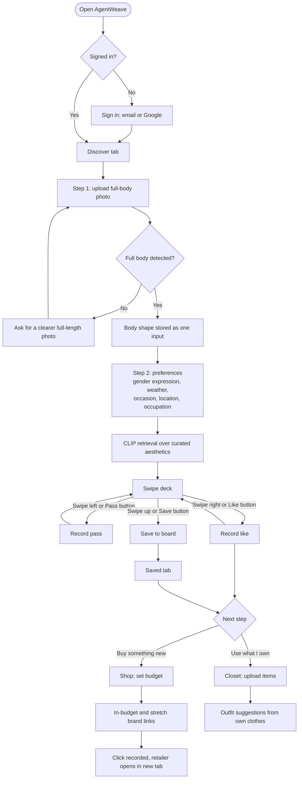

# 04. From Research to Design Decisions

This document traces each major design decision in AgentWeave back to a finding in [01 Market research](01-market-research.md), a persona or job in [02](02-personas-and-jtbd.md), or a requirement in the [PRD](03-prd.md). Where a decision rests on an assumption rather than evidence, it says so.

## 1. Decision summary

| # | Decision | Driven by | Evidence type |
|---|---|---|---|
| D1 | Swipe deck as the primary taste-capture interaction | J2, persona A; low effort | Published study plus established market pattern |
| D2 | Up-swipe saves to a persistent inspiration board | J3; Pinterest board mental model | Market pattern |
| D3 | Visible Pass / Save / Like buttons alongside gestures | Accessibility; WCAG 2.2 | Normative standard |
| D4 | Budget sliders with in-budget vs stretch split | J5; Stitch Fix price complaints | Review signals |
| D5 | My Closet alongside discovery | J4, persona C; wardrobe-app demand | Market pattern |
| D6 | Four-tab IA: Discover / Saved / Closet / Shop | One tab per job | Derived from JTBD |
| D7 | Neutral, optional body-shape treatment | E1; instability of shape categories | Published research |
| D8 | Light pastel palette (Vanilla Cream, Blush Petal, Rosewood, Sage Leaf, Misty Sky, Midnight Lagoon), serif display type, line doodles | Brand direction chosen by the product owner; audience | Assumption, to validate |

## 2. D1. Why a swipe deck

**Finding.** Swipe-to-like for fashion is a proven, familiar pattern: Mallzee launched it in 2013 with right to like and left to reject ([TechCrunch](https://techcrunch.com/2013/12/03/mallzee/)), and newer App Store entrants market the same mechanic ([Tailored listing](https://apps.apple.com/us/app/-/id6727003656)).

**Research on swipe for preference elicitation.** A 2025 TU Wien study compared four onboarding methods (Swipe, Rating, Two-Items, Four-Items) with 382 participants for a leisure-activity recommender. Swipe scored highest on usability and completion rate but produced the least accurate preference profiles; rating produced the most accurate profiles but took longer and had lower completion ([Fink, TU Wien, 2025](https://repositum.tuwien.at/handle/20.500.12708/216555)). The domain is not fashion, so this is directional only.

**Decision.** Use swipe as the first, low-effort signal because completion matters most for a new user with no history (persona A, goal G1). Accept that each swipe is a weak signal.

**Mitigations for the accuracy trade-off.**

- A third, stronger action (up = save) separates "like" from "love".
- The preference form (occasion, weather, etc.) supplies explicit context, so swipes are not the only input.
- Future backlog: use swipe history to re-rank (PRD RICE table), and test a short rating step if like rate stays low (hypothesis H4).

**Implementation note.** A drag must travel at least 80 px before it counts; shorter drags snap back, so a tap or wobble on the card is never read as a swipe (`frontend/src/lib/swipe.js`).

## 3. D2. Why a saved inspiration board

**Finding.** Pinterest's board model operates at very large scale (578M MAU in Q2 2025, [SEC 8-K](https://www.sec.gov/Archives/edgar/data/1506293/000150629325000195/q2-25xpressrelease.htm)), and Whering also offers moodboards and wishlists ([App Store](https://apps.apple.com/us/app/-/id1519461680)). Persona A's stated frustration is that saves pile up without leading anywhere.

**Decision.** Saving is one gesture (swipe up) or one tap, and the Saved tab is a first-class destination, not a buried list. Each saved look carries its caption so it can be sent to Shop later, connecting inspiration to action (J3 to J5).

**Empty state.** When nothing is saved, the board links back to Discover rather than showing a dead end.

## 4. D3. Why visible tap buttons in addition to gestures

**Standard.** WCAG 2.2 includes two criteria that apply directly to a swipe deck:

| Criterion | Level | Requirement (quoted) |
|---|---|---|
| [2.5.1 Pointer Gestures](https://www.w3.org/WAI/WCAG22/Understanding/pointer-gestures.html) | A | "All functionality that uses multipoint or path-based gestures for operation can be operated with a single pointer without a path-based gesture, unless a multipoint or path-based gesture is essential." |
| [2.5.7 Dragging Movements](https://www.w3.org/WAI/WCAG22/Understanding/dragging-movements.html) | AA | "All functionality that uses a dragging movement for operation can be achieved by a single pointer without dragging, unless dragging is essential..." |

W3C's explanation of 2.5.7 names users of trackballs, head pointers, eye-gaze systems and speech-controlled mouse emulators as people who cannot perform precise drags ([W3C Understanding 2.5.7](https://www.w3.org/WAI/WCAG22/Understanding/dragging-movements.html)).

**Decision.** Every swipe action has an equivalent single-tap button under the card: Pass, Save, Like, each with an `aria-label`. Swiping is a shortcut, never the only way. Buttons are 52 x 52 px, above the 24 x 24 CSS px minimum in [SC 2.5.8 Target Size (Minimum)](https://www.w3.org/WAI/WCAG22/Understanding/target-size-minimum.html).

**Side benefit.** Desktop mouse users and first-time users who have not discovered the up-swipe can still save (hypothesis H5).

## 5. D4. Why budget sliders with an in-budget / stretch split

**Finding.** Price is a recurring complaint about Stitch Fix in public reviews ([Trustpilot](https://www.trustpilot.com/review/stitchfix.com)). Aggregators such as Lyst monetise by commission and let brands bid for placement ([Glossy, 2018](https://www.glossy.co/fashion/how-the-lvmh-backed-aggregator-lyst-does-business/)), which means ranking is not purely in the shopper's interest.

**Decision.**

- The user sets the budget first, with two sliders ($0 to $500+) and presets. Sliders cannot cross.
- Results are split into "within budget" and "outside budget" (stretch) so the user is never surprised by price, but can still see a better match one tier up.
- Ranking is by style relevance (CLIP similarity between the look and each brand's style description), not by commission. No affiliate links are used today.
- Prices are brand-level estimates and must be labelled as such (PRD risk R6).

**Why not only in-budget results?** Assumption: some users want to see what a small budget increase would unlock. Hypothesis H6 tests this via click share on stretch picks.

## 6. D5. Why a closet next to discovery

**Finding.** Wardrobe apps (Whering, Acloset, Stylebook, Indyx) show sustained demand for digitising and re-using one's own clothes ([market research 3.3 to 3.6](01-market-research.md#3-competitor-profiles)). Indyx explicitly argues against buying new as the only path to feeling stylish ([Indyx](https://www.myindyx.com)).

**Decision.** Closet is a peer tab, not an upsell, so persona C can use AgentWeave without ever opening Shop (emotional job E3). Upload requires only a photo and a category; colour and description are optional to keep effort low, given reviewer complaints about tagging accuracy in competitors ([Whering App Store](https://apps.apple.com/us/app/-/id1519461680)).

## 7. D6. Information architecture

One tab per primary job keeps navigation flat; every core action is at most one tap from any screen.

| Tab | Job | Contents |
|---|---|---|
| Discover | J1, J2 | Two-step flow (Step 1 body photo, Step 2 preferences), then swipe deck |
| Saved | J3 | Inspiration board of saved looks, remove action, link back to Discover |
| Closet | J4 | Upload, list, delete own items; outfit suggestions from them |
| Shop | J5 | Budget controls, in-budget and stretch brand results |

Navigation is a top pill bar on desktop and a fixed four-column bottom bar on mobile, both labelled `nav aria-label="Primary"`. A "Shop this look" action on a recommendation jumps to Shop with that look's caption.

## 8. D7. Body-shape treatment

**Finding.** Body-shape typologies are unstable: Loughborough University found that moving the tape measure by 1 cm could move 40% of 1,679 women into a different shape class ([Loughborough, 2021](https://www.lboro.ac.uk/media-centre/press-releases/2021/may/you-might-not-be-the-body-shape-you-think/)). The feature also touches emotional job E1.

**Decisions.**

- The shape is one input among several, never a verdict. No measurements, numbers or "ideal" language are shown.
- Copy avoids "flattering", "hide", "fix" or similar corrective framing.
- If the pose model cannot see a full body, the user gets a plain request for a clearer photo, not a guessed category.
- Planned: make the photo step skippable and allow manual selection or "prefer not to say" (PRD open question 1, hypothesis H3).

## 9. D8. Visual direction

Status: chosen by the product owner; **not yet validated** with users. Treated as an assumption to test in usability sessions (does it read as "stylish and calm" to personas A and B?).

History: the first redesign used lavender and soft gold on a dark base with an explicit "no pink" rule. The product owner then supplied the palette below, which replaced it. Colours live as semantic tokens in `frontend/tailwind.config.js` (`canvas`, `surface`, `ink`, `muted`, `line`, plus `brand`, `sage`, `sky` scales), so components never reference raw hex values and a future palette change is a one-file edit.

| Token | Palette name | Hex | Role |
|---|---|---|---|
| `canvas` | Vanilla Cream | `#FFF7E6` | Page background |
| `surface` | (lighter cream) | `#FFFDF8` | Cards, inputs |
| `ink` | Midnight Lagoon | `#2D3A47` | Body text, headings |
| `brand-200` | Blush Petal | `#F7C8D3` | Soft fills, selected chips, doodles |
| `brand-500` / `brand-600` | Rosewood / darker step | `#B46A72` / `#9C5660` | Primary buttons, active tab, links |
| `sage-400` / `sage-700` | Sage Leaf / darker step | `#A8B58A` / `#55603F` | Secondary accent, step labels, high match scores |
| `sky-300` | Misty Sky | `#A9B7C6` | Tertiary accent, doodles, mid-range price tier |

| Element | Choice | Rationale |
|---|---|---|
| Display type | [Fraunces](https://fonts.google.com/specimen/Fraunces) (serif) for headings | Editorial, magazine feel associated with fashion print |
| Body type | [Manrope](https://fonts.google.com/specimen/Manrope) (sans-serif) | Clean and legible at small UI sizes |
| Illustration | Small hand-drawn line doodles: purse, top, skirt, flower, shoe, sparkle; low opacity, decorative | Personality without competing with photos; marked `aria-hidden` so screen readers skip them |
| Emoji | Only on the swipe actions (pass, like) and the shop / cart buttons | Product-owner decision; everywhere else uses SVG icons with text labels |

**Measured contrast** ([WCAG 2.2 SC 1.4.3](https://www.w3.org/WAI/WCAG22/Understanding/contrast-minimum.html): 4.5:1 for normal text, 3:1 for large text and UI graphics), computed with the WCAG relative-luminance formula:

| Foreground | Background | Ratio | Use | Result |
|---|---|---|---|---|
| `ink` #2D3A47 | `canvas` #FFF7E6 | 10.90:1 | Body text | Pass AAA |
| `ink-soft` #46535F | `canvas` | 7.40:1 | Secondary text | Pass AAA |
| `muted` #5F6B77 | `canvas` | 5.11:1 | Labels, hints | Pass AA |
| `faint` #6B7480 | `surface` #FFFDF8 | 4.66:1 | Input placeholders | Pass AA |
| `brand-600` #9C5660 | `canvas` | 5.03:1 | Links, accent text | Pass AA |
| `canvas` | `brand-600` | 5.03:1 | Primary button label | Pass AA |
| `brand-500` Rosewood | `canvas` | 3.76:1 | Logo (large text), Save icon (graphic) | Pass for large text and graphics only; not used for body text |
| `sage-700` #55603F | `canvas` | 6.29:1 | Step labels, match score | Pass AA |

## 10. Core user flow

## 11. What to test next

| Decision | Usability test task | Pass signal |
|---|---|---|
| D1 | "Find three looks you like" | Completes without help; like rate not near 0% or 100% |
| D2/D3 | "Keep this look for later" | Saves via button or swipe on first attempt |
| D4 | "Find where to buy this under $60" | Opens an in-budget link; understands "estimate" label |
| D6 | "Add a jacket you own" | Finds Closet tab without prompting |
| D7 | Post-task interview on body-shape step | No participant reports feeling judged |
| D8 | Five-second test on Discover | Descriptors match intended tone |
